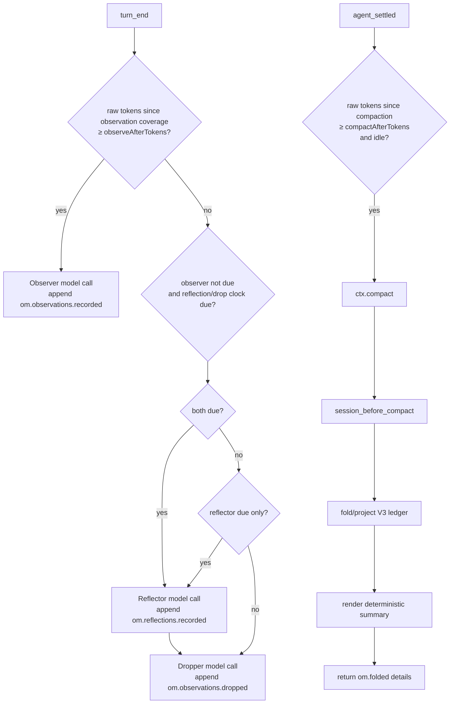

# How it works

This is the V3 technical reference for `pi-observational-memory`.

V3 is ledger-centered: memory state is reconstructed by folding V3 ledger entries on the current branch. When that projection is non-empty, V3 renders it model-free into the summary the agent sees. Empty projections delegate to Pi's native summarizer.

## Runtime entry points

`src/index.ts` registers one shared runtime and these Pi surfaces:

| Surface | Purpose |
|---|---|
| `turn_end` observer trigger | Maybe run the observer in the background. |
| `turn_end` reflect/drop trigger | Maybe run the due reflector, then run dropper maintenance only after same-run successful reflection. |
| `before_agent_start` snapshot | Record the session's context files (`systemPromptOptions.contextFiles`) for the reflector. Observe only. |
| `agent_settled` compaction trigger | Maybe call `ctx.compact()` when idle and over `compactAfterTokens`, after Pi finishes retries and queued continuation. |
| `session_before_compact` hook | Build the V3 compaction payload deterministically. |
| `/om:status` | Show ledger counts, drift, progress clocks, and worker state. |
| `/om:reflect` | Force a full memory pass, then a full-fold compaction. |
| `/om:promote` | Promote durable reflections into the project's `.memory.md` and `.memory/`, after a preview and confirmation. |
| `/om:ground` | `/om:reflect` whose review checks memory and the promoted `.memory.md` lines against the repository with read-only tools. |
| `/om:view` | Show visible or full memory content and attempt to copy the rendered memory text. |
| `recall` tool | Recover source evidence for a memory id. |

## Lifecycle overview



The observer has priority. Reflect/drop does not run on a turn where observer work is due.

## Source entries and progress

V3 raw-token progress counts only source entries:

- `message`
- `custom_message`
- `branch_summary`

Memory ledger entries and compaction entries do not add raw-token progress.

Every V3 ledger entry has `data.coversUpToId`. That field is a progress and projection watermark. Worker clocks count raw/source tokens after the latest valid watermark for that worker's ledger type:

| Worker/trigger | Progress source |
|---|---|
| Observer | latest `om.observations.recorded.data.coversUpToId` |
| Reflector | latest `om.reflections.recorded.data.coversUpToId` |
| Dropper | latest `om.observations.dropped.data.coversUpToId` |
| Auto-compaction | latest compaction boundary |

The watermark is also used to decide whether a memory ledger entry belongs to a bounded projection. It is not provenance. Provenance lives in `sourceEntryIds` and `supportingObservationIds`.

## Ledger data shapes

### Observations recorded

```ts
customType: "om.observations.recorded"
data: {
  observations: Observation[];
  coversUpToId: string;
}
```

Each observation:

```ts
type Observation = {
  id: string;
  content: string;
  timestamp: string;
  relevance: "low" | "medium" | "high" | "critical";
  sourceEntryIds: string[];
  tokenCount: number;
}
```

The builder rejects empty observation arrays, so no empty progress entries are written.

### Reflections recorded

```ts
customType: "om.reflections.recorded"
data: {
  reflections: Reflection[];
  coversUpToId: string;
}
```

Each reflection:

```ts
type Reflection = {
  id: string;
  content: string;
  supportingObservationIds: string[];
  tokenCount: number;
  replaces?: string[];
}
```

The reflector must cite valid active observation ids. `replaces` lists the reflections a replacement supersedes; records without it stay valid.

### Observations dropped

```ts
customType: "om.observations.dropped"
data: {
  observationIds: string[];
  coversUpToId: string;
}
```

Drops are tombstones. They remove ids from active observations but do not delete ledger history.

### Reflections dropped

```ts
customType: "om.reflections.dropped"
data: {
  reflectionIds: string[];
  replacedBy?: string;
  kind?: "stale" | "duplicate" | "project-instructions" | "promoted"; // plain retirements only
  coversUpToId: string;
}
```

Retirements are tombstones for reflection ids, kept even when the reflection record is unknown or recorded later. The only exceptions are kinds `project-instructions` and `promoted`: a later `om.reflections.recorded` entry (in branch order) that contains the id re-activates it. A permanent retirement is never turned back into a reversible one. Entries without `kind` keep the pre-kind shape byte for byte. The fold keeps every reflection record (`reflections`, `reflectionsById`) and exposes `activeReflections`, `retiredReflectionIds`, `reflectionReplacedBy`, and `reflectionRetirementKind`; projections and recall apply the same re-activation rule. Observer, reflector, and dropper inputs, dropper coverage, and projections use active reflections only. Retirements do not advance any progress clock.

### Folded compaction details

```ts
details: {
  type: "om.folded";
  version: 1;
  fullFold: boolean;
  observations: Observation[];
  reflections: Reflection[];
}
```

These details are what later visible projections read. The ledger remains the source of truth.

## Observer flow

The observer trigger runs on `turn_end`.

1. Load config if needed.
2. Skip if `passive` is true.
3. Skip if `observerInFlight` is true.
4. Count raw/source tokens since latest observation coverage.
5. Skip if below `observeAfterTokens`.
6. Honor any deliberate-empty backoff until another `observeAfterTokens` of source tokens arrive.
7. Select the oldest size-capped chunk after the latest observation coverage marker.
8. Serialize those source entries for the observer prompt.
9. Resolve the memory model.
10. Run `runObserver()` in a background task.
11. Validate source ids returned by the model.
12. Compute deterministic 12-character ids and per-observation token counts in code.
13. Append `om.observations.recorded` only if at least one observation was accepted.

If no observations are generated, the worker writes no entry and does not advance coverage. A later eligible observer run will see a larger range. Deliberate empty runs back off until another `observeAfterTokens` worth of new source tokens arrives, so they do not re-fire every turn. Observer chunks target a fixed 60,000 estimated tokens, oldest-first, so an oversized uncovered span drains in slices; the oldest entry is always included even if it alone exceeds the target, preventing coverage from stalling. API/stream failures surface as `observer failed` / `observer.stream_error` rather than as an empty run.

## Reflect/drop flow

Reflect/drop also runs on `turn_end`, but only when the observer is not due.

1. Load config if needed.
2. Skip if `passive` is true.
3. Skip if observer or reflect/drop work is already in flight.
4. Skip if observer progress has reached `observeAfterTokens`.
5. Check the reflector raw-token clock against `reflectAfterTokens`.
6. Resolve the model only for stages that are ready to run.
7. Fold current ledger state.
8. If reflector is due and observation coverage exists, run the reflector. Each active observation line is annotated with current reflection coverage (`none`, `partial`, or `strong`) so the reflector can review uncovered durable facts without treating coverage as a quota.
9. Append non-empty `om.reflections.recorded` with `coversUpToId` set to the latest observation coverage marker. Support ids are downstream dropper coverage evidence and should include all and only observations whose durable meaning is preserved with equivalent fidelity. The crystallize prompt shows active reflections only, but its duplicate check covers every recorded reflection id, retired ones included, except ids retired as `project-instructions`.
10. If crystallize appended reflections, run the review (`src/agents/reviewer`, tool `tidy_reflections`) on the same resolved reflector model, with the same per-call fallback retry. It sees active reflections as `[id] (recorded YYYY-MM-DD HH:MM) [new]? content` plus active observations as evidence. Each plain retirement names a kind (`stale`, `duplicate`, `project-instructions`). Code validates every decision and reports problems back to the model: ids must be active, each id is decided once, `[new]` ids can be retired outright only with kind `project-instructions`, and content must be one non-empty line. A replacement whose content hashes to a retired id or to one of its own replaced ids is rejected. A replacement whose content hashes to another active reflection retires the replaced ids with `replacedBy` set to that reflection. Accepted decisions are written with the crystallize coverage marker: one `om.reflections.recorded` entry with the replacements, one `om.reflections.dropped` entry per replacement group (with `replacedBy`), and one per retirement kind for plain retirements. A review failure is recorded as a review error (`review failed: …`), and crystallize output is kept. `runConsolidationPipeline(..., { forceReflection: true })` runs the reflector regardless of its clock and reviews even when crystallize records nothing.
Both calls get the project context block at the top of their user message: `PROJECT INSTRUCTIONS (loaded into every session of this project; reference only):` followed by `### <path>` and each file's content (the same on claude-bridge and direct models; the worker instructions stay where `workerMessages` puts them). The files come from the `before_agent_start` snapshot, from `/om:reflect`'s `ctx.getSystemPromptOptions()` refresh, or, when neither exists yet (a fresh runtime after `/reload`, or a run started with `triggerTurn`, which skips `before_agent_start`), from Pi's exported `loadProjectContextFiles({ cwd, agentDir })`; the project's `.memory.md`, read fresh, is appended last (see `/om:promote` below). Whole files are kept within `max(20000, floor(0.1 * reflector contextWindow))` estimated tokens (or `projectContextMaxTokens`), filled from the most specific (last) file backwards; omitted files are listed as `(omitted: <path>, ~N tokens)`. With no files, or `projectContext: false`, the user message is unchanged. Each call logs `reflector.project_context` (call, source `snapshot|command|loader|none`, file count, estimated tokens, omitted paths).
11. Only after crystallize or review recorded something in this run, check whether the folded active observation pool is over `observationsPoolTargetTokens`.
12. If over target, run the dropper with the post-review active reflections. It computes a maximum drop count from tokens over target converted to an approximate observation count and annotates active observations with reflection coverage tiers (`none`, `partial`, `strong`) for model judgment.
13. Append non-empty `om.observations.dropped` with `coversUpToId` set to the earlier branch position of latest observation coverage and same-run reflection coverage.

Crystallize no-output skips the review (unless forced) and the same-turn dropper; crystallize failure ends the pass. A review failure keeps crystallize output and still lets the dropper run. Dropper failure does not roll back already-appended reflections.

## Auto-compaction trigger

The auto-compaction trigger runs on `agent_settled`, after Pi has finished automatic retries, automatic compaction, and queued continuation.

It skips when:

- `passive` is true;
- compaction is already in flight;
- estimated source-entry progress after the latest compaction boundary is below `compactAfterTokens`;
- Pi is not idle after the deferred check;
- the raw threshold is no longer met after the deferred check.

The count starts at `firstKeptEntryId` when Pi provides that boundary. Memory
ledger entries and compaction metadata contribute zero. The trigger uses this
same raw metric before scheduling and in the deferred re-check, then calls
`ctx.compact()` when all checks pass.

This trigger does not wait for observer, reflector, or dropper promises. That is intentional: background memory work should never make compaction feel stuck.

## Compaction hook

The compaction hook runs on `session_before_compact` and is the critical V3 latency path.

It does only deterministic work:

1. Guard against duplicate concurrent compaction hooks.
2. Load config if needed.
3. Read `event.preparation.firstKeptEntryId` and `event.preparation.tokensBefore`.
4. Build a compaction projection from branch entries and `firstKeptEntryId`.
5. Render a summary from projected reflections and observations.
6. If the summary is empty, return no extension result so Pi uses native compaction.
7. Otherwise return `{ compaction: { summary, firstKeptEntryId, tokensBefore, details } }` where `details.type` is `om.folded`.

It does not:

- call a model;
- run a sync observer;
- run reflector/dropper;
- wait for worker promises;
- append ledger entries.

If another compaction hook is already in flight, it returns `{ cancel: true }`. Delegating an empty projection is intentionally different: Pi proceeds with its native summarizer so pre-cut context is preserved.

## Projections

V3 uses projection helpers so commands, compaction, and recall do not each invent their own truth.

### Full projection

Full projection folds valid V3 observations, reflections, drops, and reflection retirements from branch root through the requested boundary. Memory entries are included by resolving their `data.coversUpToId` marker against the boundary, not by the physical position of the `om.*` custom entry. Old V2 entries/details, invalid V3-shaped entries, and dangling coverage markers are ignored.

### Visible projection

Visible projection without a boundary reads the latest V3 `om.folded` compaction details. This is what the agent currently sees.

### Compaction projection

When compaction runs, the projection helper decides whether this compaction is a full fold. It first builds the normal compaction projection: observations whose `coversUpToId` reaches `firstKeptEntryId`, with reflection/retirement/drop effects held stable from the latest full-fold boundary. If there is no previous full-fold boundary, normal compaction includes observations only and excludes reflections/drops. It sums that projection's active observation `tokenCount`; if the total is at or above `observationsPoolMaxTokens`, it performs a full fold through `firstKeptEntryId`, applying observations, reflections, retirements, and drops by coverage marker. Otherwise, it keeps the normal projection. Retirements never trigger a full fold by themselves; they become visible at the next one.

### Diff projection

Diff projection compares visible memory with full memory. `/om:status` uses this to show recorded-vs-visible drift. `/om:status` also reports the visible observation pool separately from the folded active observation pool because compaction pressure and dropper maintenance intentionally use different projections and thresholds.

## Summary rendering

The renderer returns an empty string when there are no visible observations or reflections. Otherwise it starts with deterministic usage instructions that tell the agent how to treat the memory, how to handle conflicts, and when to use `recall` for exact source context. It then renders reflection and observation sections when those entries exist:

```md
These are condensed memories from earlier in this session.

- Reflections: stable, long-lived facts about the user, project, decisions, and constraints. New reflection lines may include ids in brackets.
- Observations: timestamped events from the conversation history, in chronological order. Observation lines include ids in brackets.

Treat these as past records. When entries conflict, the most recent observation reflects the latest known state. Work that prior observations describe as completed should not be redone unless the user explicitly asks to revisit it.

When exact source context is needed for precision or traceability, use the recall tool with the relevant observation or reflection id. This is especially useful when a reflection materially affects a decision or is too compressed to continue confidently. Do not use recall as broad search or inject raw source unless it is needed.

## Reflections
[id] durable reflection

## Observations
[id] YYYY-MM-DD HH:MM [relevance] timestamped observation
```

The renderer is deterministic. It does not call a model and does not rewrite memory content.

## Commands

### `/om:status`

Shows:

- recorded/dropped/visible observation counts, with plain `+N` / `-N` visible-vs-full drift suffixes when drift exists;
- recorded/visible reflection counts, with a plain `+N` drift suffix when full memory has extra reflections; once any reflection is retired, the line also shows retired/active counts and a `-N` suffix for visible reflections retired in full memory;
- next observation/reflection/compaction token progress and drop coverage since the last successful drop;
- visible observation pool pressure against `observationsPoolMaxTokens` from the current compaction projection;
- active observation pool pressure against `observationsPoolTargetTokens` from folded active observations;
- dropper state explaining whether the active pool is under target or waiting for the next successful reflection;
- reflection pool token total;
- `Project context: N file(s), ~T tokens`, only when the reflector would see context files;
- `Promoted: N lines (~T tokens) in <path>`, only when the project has a `.memory.md`;
- passive mode;
- worker in-flight flags;
- last observer and reflect/drop errors.

### `/om:view`

Default mode shows visible memory and attempts to copy the rendered memory text to the clipboard. If no V3 compaction has happened yet, visible memory can be empty because nothing has been folded into `om.folded` details; use `/om:view full` to inspect recorded branch memory before the first compaction.

Clipboard copy uses platform clipboard commands (`pbcopy`, `clip`, `wl-copy`, `xclip`, `xsel`, or `termux-clipboard-set`). If copying succeeds, Pi shows `Copied /om:view output to clipboard.` If copying fails, the command still prints the memory view and shows a warning. The clipboard text is only the rendered memory content; it does not include the success/failure line.

### `/om:view full`

Shows full V3 ledger truth at branch tip, without retired reflections, and attempts to copy the rendered memory text to the clipboard using the same success/failure behavior as default `/om:view`. When reflections are retired, it adds a `Retired reflections: N` line to the shown output; that line is not copied.

### `/om:reflect`

Forces a memory pass and a full-fold compaction, so cleanup shows up in the agent's context right away. OM cannot know Pi's cut (`firstKeptEntryId`) before calling `ctx.compact()`, so the pass runs inside the compaction hook:

1. The command refuses while the agent is running a turn (`ctx.isIdle()`; Pi's `compact()` aborts a running turn first) or a compaction is in flight, waits for running background consolidation, refreshes the project context files from `ctx.getSystemPromptOptions()` when the host provides it, then sets a one-shot `runtime.reflectRequest` and holds `compactInFlight` so the auto-compaction trigger cannot fire. It calls `ctx.compact()` without awaiting it; the result arrives through its callbacks.
2. `session_before_compact` consumes the request before its first await. It then runs `runConsolidationPipeline` under the consolidation lock (`launchConsolidationTask`, so the `turn_end` trigger cannot launch meanwhile), with `forceObservation`, `forceReflection`, `coverageLimitId: firstKeptEntryId`, and the compaction's abort signal:
   - The observer ignores its clock and deliberate-empty backoff, and reads one chunk of source entries only through the cut.
   - Every entry the pass writes caps its `coversUpToId` at the cut, `earlierCoverageMarkerId(normal marker, firstKeptEntryId)`. The pass therefore lands in this fold, even when an earlier observer run covered entries past the cut.
   - The dropper still runs only when the active pool is over `observationsPoolTargetTokens`, because its drop budget is zero otherwise.
3. The hook re-reads the live branch and builds the compaction projection with `forceFullFold`. Worker failures are recorded as usual, and the fold still happens. An empty projection still delegates to Pi's native summarizer.
4. `onComplete` reports observations recorded and dropped, reflections added, replaced, and retired, and summary sizes before (latest visible memory) and after. If Pi rejects before the hook runs because there is nothing to compact ("Nothing to compact", "Already compacted"), `onError` runs the same forced pass without a cut or abort signal (coverage uncapped, like a normal pass, still holding `compactInFlight`) and reports its counts; the new memory reaches the agent at a later compaction. Any other rejection is reported as a failure. Every path clears the request and `compactInFlight`.

### `/om:ground`

The `/om:reflect` pass, in the same hook with the same cut cap, full fold and small-session fallback, except that the review is a grounding review. Grounding is never automatic.

1. Guards: as `/om:reflect`, plus a running `/om:promote`. The promote target (main worktree root from a linked worktree, else `ctx.cwd`) is resolved and its `.memory.md` parsed up front. The request carries a `GroundingRequest` and a progress callback (`ConsolidationOptions.grounding` / `onProgress`, unused by automatic passes).
2. Review (`src/agents/reviewer`): the normal review's inputs and `tidy_reflections`, plus `GROUNDING_SYSTEM` appended to `REVIEW_SYSTEM`, `.memory.md`'s lines as `.memory.md PROMOTED LINES`, the project root, and the context files without `.memory.md` (`contextFilesWithoutMemoryFile`, so its lines appear once). Tools: Pi's `createReadTool`/`createGrepTool`/`createFindTool`/`createLsTool`/`createBashTool` rooted at the project root (`repo-tools.ts`); bash gets a 60 s default timeout capped at 120 s and a `spawnHook` env with `GIT_PAGER=cat PAGER=cat GIT_TERMINAL_PROMPT=0 CI=1 GIT_OPTIONAL_LOCKS=0`. No command denylist: the prompt is the read-only guard. The turn cap is `groundMaxTurns`. Differences from the normal review: every retirement is its own entry with the model's `reason`, replacements carry their reasons on the dropped entry, and a `[new]` reflection may be retired as `stale`. `revise_promoted_block` collects `{ id, action: "rewrite" | "remove", content?, reason }` per block line (known block id, decided once, single-line content with a fresh content hash, evidence behind a rewritten line, block within `promoteMaxTokens`) and `report` items for stale hand-written text. The compaction signal reaches every tool run, so Esc stops them; a review whose signal was aborted writes nothing.
3. After `onComplete` (or the small-session pass, which runs without a signal, bounded by `groundMaxTurns` and the bash timeout), outside the hook: the block revisions become a `PromotePlan` against the file as it is now and the live branch (`src/project-memory/ground.ts`), refused when the lines changed during grounding. Other lines are kept; a rewrite is a new reflection replacing the line's record (dropped entry with `replacedBy` and the reason) and retired as `promoted`; a removed line's reflection, when on the branch, is retired as `stale` with the reason. The `/om:promote` preview (plus the evidence and the stale-text report) is shown, then confirmed and applied exactly as `/om:promote` does it (re-fold and `stalePlanReason`, `.memory/` writes and orphan cleanup, ledger entries). Without UI the preview is printed and nothing is written.
4. Report: the `/om:reflect` report plus tool calls, reflections retired as stale and rewritten, the block outcome (applied, declined, preview only, not applied: why) and the stale hand-written text.
5. Progress: an `om-ground` status widget. Inside the hook Pi already shows "Compacting context… (esc to cancel)", so it is one plain line (stage, tool calls, elapsed time, refreshed each second); on the small-session path and while writing it is Pi's `Loader`, updated with `setMessage()`. It is hidden before the confirm dialog and cleared on every path.

### `/om:promote`

1. Guards: refuses while a compaction, `/om:reflect` or another promotion runs; waits for running consolidation, then holds the consolidation lock (so no worker starts) for the model call and again for the apply, not while the confirm dialog is open.
2. Target: `.memory.md` and `.memory/` at the git worktree root, `ctx.cwd` outside git. In a linked worktree (`.git` file whose gitdir's `commondir` is another checkout's `.git`) the target is the main worktree's root, and the preview says so, so every worktree shares one file. OM reads `.git`, `gitdir` and `commondir` itself. The file is OM's: `- [id] content` lines are linked to `.memory/`, other `- ` lines get a content hash, the fixed header is skipped, and any other text is listed in the preview as dropped.
3. Model call (`src/agents/promoter`): the reflector model, else the memory model, with the fallback retry, instructions through `workerMessages`. Input: `.memory.md`'s lines with ids (hand-written lines without an id get a content hash), the session's context files without `.memory.md`, active reflections with record times, and the budget. The `set_promoted_block` tool takes the full new block (`{ keepId }` or `{ content, fromIds }` per line) and rejects it with feedback when: a keepId is not a block line; a fromId is neither an active reflection nor a block line; an id is used twice; content is empty or multi-line; a new line's id (content hash) is retired, one of its own fromIds, or another active reflection or block line; none of its fromIds has recorded evidence; or the block exceeds `promoteMaxTokens`. Content identical to its single source keeps that id (pure promotion).
4. Plan and preview: removed (`-`), kept (`=`) and new (`+`) lines, the `.memory/` files to add (transitive closure over `replaces` and `supportingObservationIds`, from the branch ledger including retired and dropped records, else existing `.memory/` files; missing records are listed), the `.memory/` files to remove (regular `<id>.md` files not reachable over the same links from any id line of the new block; kept lines are followed through the ledger and their `.memory/` files, lines without an id reach nothing, other names, subdirectories and symlinks are never touched), ledger changes, and block tokens against the budget. It is shown with `ctx.ui.notify`, then `ctx.ui.confirm` asks with a one-line summary. Without a UI the preview is printed and nothing is written.
5. Apply, under the lock, aborting without writes when `.memory.md` changed on disk or a source reflection is no longer active (the branch is re-folded): new `.memory/` files (`wx`, existing files untouched); `.memory.md` rendered whole through a temp file and rename (deleted when no lines remain, untouched when unchanged); the orphaned `.memory/` files (one that vanished meanwhile is skipped); then `om.reflections.recorded` for rewritten lines, one `om.reflections.dropped` with `replacedBy` per rewrite for its sources in the ledger, and one `om.reflections.dropped` with kind `promoted` for every promoted id. `coversUpToId` is the latest observation coverage marker.
6. Reaching the agent: OM's `before_agent_start` handler reads `.memory.md` fresh and pushes it onto `event.systemPromptOptions.contextFiles` (after Pi's files, skipped when that path is listed, when the file has no lines, with `promotedMemory: false`, or when `process.argv` has `--no-context-files`/`-nc`), then snapshots the list without it. Pi 0.87 re-renders the prompt from those options, so no `/reload` is needed; a changed file becomes a new project-context system message in the session. `resolveProjectContextFiles` appends the same fresh read for the workers. `triggerTurn` turns skip `before_agent_start` and render without the file.
7. Status: with a UI, an `om-promote` widget (`statusWidget` in `src/commands/status-widget.ts`, shared with `/om:ground`) above the editor shows Pi's spinner (`Loader`, as for "Compacting context...") during the model call and the apply; it is hidden for the preview and confirm dialog and always cleared at the end.

`.memory/<id>.md` frontmatter is a subset OM writes and parses itself: scalars and inline `[a, b]` id lists (`id`, `kind`, `session`, `replaces`, `supportingObservationIds`, `promotedAt` on promoted lines only; observations: `timestamp`, `relevance`, `session`, `sourceEntryIds`). The body is the record text verbatim; a reflection's body is followed by a blank line and an `<!-- om:links -->` block. Parsing normalises CRLF and removes only the line ending that separates the body from what follows; a body that no longer hashes to its id is still used, with a "text edited since promotion" note.

## Recall flow

The agent-facing `recall` tool accepts a 12-character lowercase hex id.

1. Validate id shape.
2. Read the current branch.
3. Index V3 observations, reflections, drops, and reflection retirements from ledger history.
4. Match the id against observations and reflections.
5. For observations, mark status as `active` or `dropped`.
6. Resolve observation source entries from `sourceEntryIds`.
7. For reflections, mark retired ones `retired` (with the retirement kind when known, e.g. `retired (covered by project instructions)`) and `replaced by [id]` when known, list the retired reflections named by `replaces`, and resolve supporting observations (active or dropped) and their sources.
8. Return exact evidence plus diagnostics for missing/non-source entries.
9. When the id is not on the branch, look for `.memory/<id>.md` walking up from `ctx.cwd` (nearest wins), then in the promote target's store. Render it in the same layout, labelled `From project memory (<dir>/):`, following `replaces` and supporting observations through the store. Sources come from the branch when the record's `session` is the current one, else from `*_<session>.jsonl` under any directory next to `sessionManager.getSessionDir()` (the session id is validated before any path is built, and at most 64 MB of the file is read, keeping only the needed entries). A session not on this machine is noted instead.

Recall ignores old V2 memory by construction because it indexes only V3 ledger entry types.

## Error and race handling

- Worker in-flight flags prevent duplicate observer or reflect/drop runs.
- Observer priority prevents reflect/drop from advancing while source text is due for observation.
- No-output workers append no empty ledger entries.
- Invalid source/support/drop ids are filtered or rejected by code.
- Background worker errors are recorded on runtime state and surfaced in `/om:status`.
- Compaction does not wait for background workers; it folds whatever ledger state is already present.
- Historical or invalid coverage markers are tolerated by progress helpers instead of throwing.

## V2 behavior

V3 does not use V2 state shapes. Old V2 custom memory entries, old V2 compaction details, and old V2 config keys are ignored. Existing old visible compaction text in a continued session may remain visible until a V3 compaction replaces it. The recommended upgrade path is to update settings and start a new clean session.

## Invariants

- The branch-local V3 ledger is the memory source of truth.
- Pi compaction summaries represent what the agent sees.
- Non-empty V3 compaction projections are deterministic and model-free; empty projections delegate to Pi's native summarizer.
- Observer input is raw/source entries only.
- `coversUpToId` is a progress/projection watermark, not provenance.
- Kept observations and reflections are rendered without paraphrase.
- Dropped observations and retired reflections remain recallable from ledger history.
- Old V2 memory is ignored rather than migrated.
- `/om:ground` never runs automatically, gives tools to no call but its review, and writes `.memory.md` only through `/om:promote`'s apply after confirmation.
- `/om:promote` never touches AGENTS.md or other context files, never rewrites a `.memory/` file, removes only the orphaned `<id>.md` files listed in the preview, and never runs git. Without a `.memory/` store and a `.memory.md` with lines, recall, status, the main agent's context files and worker inputs are unchanged.
